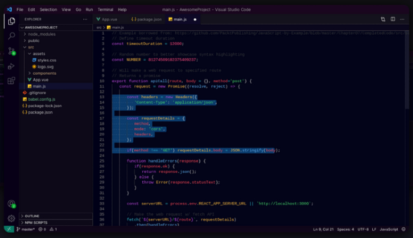

## AvdanOS Visual Studio Code Theme
The official AvdanOS VSCode Theme made and maintained by [Akane](https://github.com/akane6704)

> Current version: 1.0.1 (see changelog)

### Screenshot

### Installation and Setup
1. Install the theme from the VSCode marketplace (search AvdanOS) OR install it using [this link](https://marketplace.visualstudio.com/items?itemName=akane6704.avdanos)
2. Open VSCode (if you haven't already) and it should automatically apply. If it doesn't, follow these steps:
    - Open the Quick Settings by clicking on the Settings cog
    - Click on "Color Theme"
    - Then select "AvdanOS Dark"

**Enjoy!**
